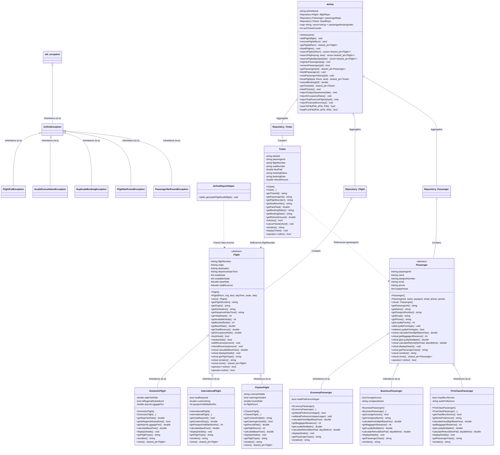

# UML Class Diagram — SkyLink Airways System

This document provides complete UML Class Diagrams for the Airline Reservation & Flight Management System, illustrating class hierarchies, attributes, operations, visibility specifiers, and object relationships.

---

## 1. Visual Mermaid Class Diagram



---

## 2. Text / ASCII Hierarchy Overview

```
                      +-----------------------------+
                      |       Flight (Abstract)     |
                      +-----------------------------+
                                     ^
                                     | (Inheritance)
           +-------------------------+-------------------------+
           |                         |                         |
+---------------------+   +-----------------------+   +--------------------+
|   DomesticFlight    |   |  InternationalFlight  |   |   CharterFlight    |
+---------------------+   +-----------------------+   +--------------------+

                      +-----------------------------+
                      |     Passenger (Abstract)    |
                      +-----------------------------+
                                     ^
                                     | (Inheritance)
           +-------------------------+-------------------------+
           |                         |                         |
+---------------------+   +-----------------------+   +--------------------+
|  EconomyPassenger   |   |   BusinessPassenger   |   | FirstClassPassenger|
+---------------------+   +-----------------------+   +--------------------+

                      +-----------------------------+
                      |           Ticket            |
                      +-----------------------------+
                         |                       |
                         v (Refers to)           v (Refers to)
                      [Flight]              [Passenger]

                      +-----------------------------+
                      |           Airline           |
                      | (Aggregates & Coordinates)  |
                      +-----------------------------+
                         |           |           |
                         v           v           v
                    [Flights]  [Passengers]  [Tickets]
```

---

## 3. Relationships & OOP Mechanisms Table

| Relationship Type | Source Class | Target Class | Description & OOP Rationale |
| :--- | :--- | :--- | :--- |
| **Inheritance (`is-a`)** | `DomesticFlight`, `InternationalFlight`, `CharterFlight` | `Flight` | Hierarchical inheritance with polymorphic pricing and route rules. |
| **Inheritance (`is-a`)** | `EconomyPassenger`, `BusinessPassenger`, `FirstClassPassenger` | `Passenger` | Hierarchical inheritance with polymorphic refund and multiplier logic. |
| **Inheritance (`is-a`)** | `FlightFullException`, `DuplicateBookingException`, etc. | `AirlineException` | Custom exception hierarchy derived from `std::exception`. |
| **Aggregation (`has-a`)**| `Airline` | `Flight`, `Passenger`, `Ticket` | The airline manages independent collections stored in `Repository<T>`. |
| **Association (`uses-a`)**| `Ticket` | `Flight`, `Passenger` | A ticket records a completed booking between a passenger and a flight. |
| **Friendship** | `AirlineReportHelper` | `Flight` | Friend class allowed direct inspection of private revenue members. |
| **Templates** | `Repository<T>` | Generic Type `T` | Type-safe generic container replacing repetitive boilerplate. |
